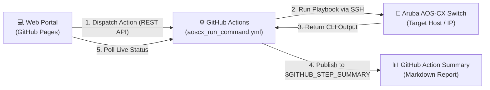

# 🌐 Aruba AOS-CX Ansible Automation & Web Dispatcher

A modern, cloud-ready network automation repository designed to run **Ansible playbooks against Aruba AOS-CX switches** using **GitHub Actions**, with rich **Markdown Step Summaries** and an interactive **GitHub Pages Web Portal**.

---

## 📑 Architecture Overview



---

## 📁 Repository Structure

```text
├── .github/
│   └── workflows/
│       └── aoscx_run_command.yml      # Workflow with inputs & GitHub Step Summary
├── docs/                              # GitHub Pages Web Interface
│   ├── index.html                     # Responsive UI dashboard
│   ├── style.css                      # Custom animations & theme
│   └── app.js                         # REST API dispatcher & status tracker
├── playbooks/
│   └── run_command/
│       ├── aoscx_run_command.yml      # Aruba AOS-CX command execution playbook
│       └── ping_test.yml              # Connectivity verification playbook
├── src/
│   └── ansible.cfg                    # Optimized Ansible configuration
├── .gitignore
├── index.html                         # Root redirect to /docs
└── README.md
```

---

## 🚀 Setup & Configuration

### 1. Configure GitHub Repository Secrets
To connect to your switches securely, define the following secrets in **Settings > Secrets and variables > Actions > Repository secrets**:

| Secret Name | Description | Example |
| :--- | :--- | :--- |
| `SSH_ANSIBLE_USER` | Switch SSH username | `admin` |
| `SSH_ANSIBLE_PASSWORD` | Switch SSH password | `********` |

> [!NOTE]
> Secrets are injected dynamically into Ansible during runner execution and are never exposed in logs or on the web interface.

---

### 2. Enable GitHub Pages
To host the interactive web interface:
1. Go to your repository on GitHub.
2. Navigate to **Settings > Pages**.
3. Under **Build and deployment > Source**, select **Deploy from a branch**.
4. Set the branch to `main` (or your default branch) and the folder to `/docs`.
5. Click **Save**.
6. GitHub will provide your live URL: `https://<username>.github.io/<repo>/`.

---

### 3. Generate a Personal Access Token (PAT) for the Web UI
Because the web interface is a client-side static page running in your browser, it uses the official GitHub REST API to trigger `workflow_dispatch`.

1. Go to [GitHub Token Settings](https://github.com/settings/tokens/new?scopes=repo,workflow).
2. Create a token with:
   - **Classic Token**: Check `repo` and `workflow`.
   - **Fine-Grained Token**: Grant **Actions (Read and write)** and **Metadata (Read-only)** on this repository.
3. In the web portal, click **Configure GitHub**, paste your token, and save.
4. The token is saved in your browser's `localStorage` and only communicates directly with `api.github.com`.

---

## 📊 How the GitHub Step Summary Works

Rather than requiring you to download `.zip` artifacts from the run, the workflow directly writes to `$GITHUB_STEP_SUMMARY`.

When a run finishes, your GitHub Actions page renders:
- **Execution Parameter Table**: Target switch IP, Command executed, Runner environment, and status badge (🟢 Success / 🔴 Failed).
- **Collapsible Command Output**: The exact CLI output captured from the switch, styled inside a Markdown syntax-highlighted block.

### Example Summary Preview:

```markdown
## 🌐 Aruba AOS-CX Execution Summary

| Parameter | Value |
| :--- | :--- |
| **Target Switch** | `10.100.20.5` |
| **Command** | `show version` |
| **Runner** | `self-hosted` |
| **Execution Status** | 🟢 **Success** |

### 📋 Output for `10.100.20.5`
<details open><summary>Click to collapse output</summary>

```text
ArubaOS-CX 10.09.0010
Product: Aruba JL658A 6300M 24SFP+ 4SFP56 Switch
ROM: Version FL.01.08
...
```
</details>
```

---

## 🖥️ Running Workflows

### Option A: From the Web Interface (Recommended)
1. Open your GitHub Pages URL (or open `docs/index.html` locally).
2. Enter one or multiple switch IPs/hostnames (e.g. `192.168.72.128, 192.168.72.129` or separate with newlines).
3. Click a command preset button (e.g. `show version`, `show running-config`, `show vlan`, etc.) or type a custom command.
4. Choose the runner (`self-hosted` for internal network switches or `ubuntu-latest`).
5. Click **Initiate Action Workflow**.
6. Watch the live status tracker poll the run, then click **Open GitHub Step Summary & Logs** to view output for each switch!

### Option B: From the GitHub Actions UI
1. Go to the **Actions** tab in your repository.
2. Select **Run AOS-CX Command** from the left sidebar.
3. Click **Run workflow**, specify the `hostname`, `command`, and runner type, and click **Run workflow**.

---

## 🛠️ Adding More Playbooks

To add new playbooks:
1. Place your new playbook under `playbooks/<category>/<playbook_name>.yml`.
2. Create a corresponding workflow in `.github/workflows/<workflow_name>.yml` with `workflow_dispatch` inputs.
3. Include the Step Summary step to automatically display the playbook output.
